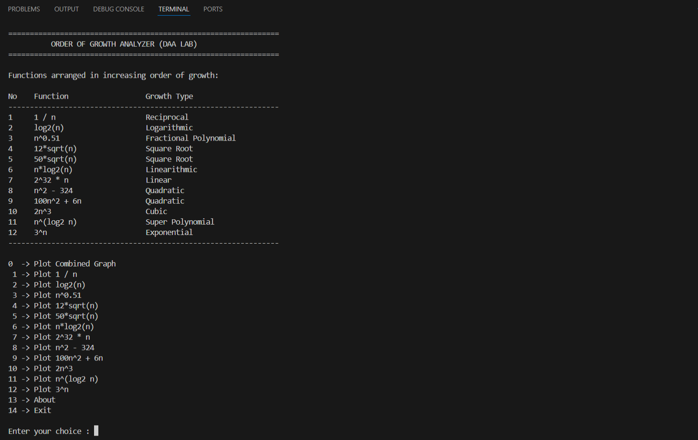
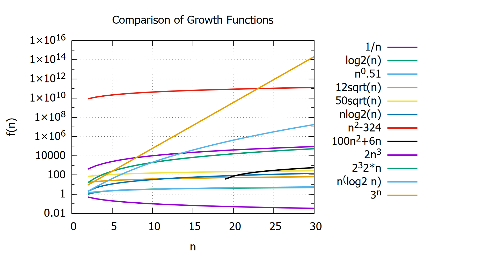
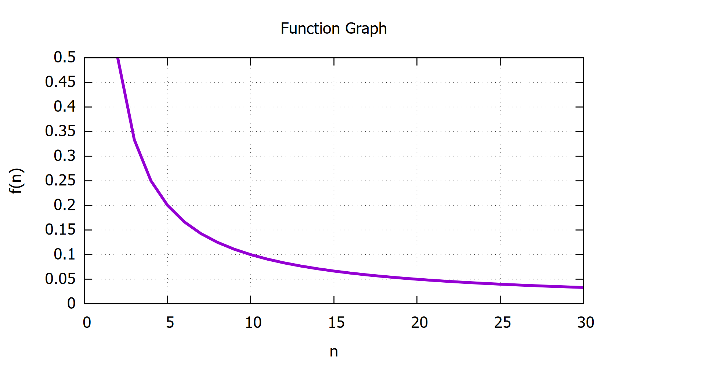

# Growth Function Visualizer

A simple C program that compares the growth of common asymptotic functions used in Design and Analysis of Algorithms (DAA). The program generates data for each function and visualizes it using **GNUPlot**.

---

## Demonstrations

### Terminal


### Combined Graph


### Single Graph: Graph of (1/n)



---

## Functions Compared

The functions are arranged in increasing order of asymptotic growth.

| No | Function | Growth Type |
|----|----------|-------------|
| 1 | 1 / n | Reciprocal |
| 2 | log₂(n) | Logarithmic |
| 3 | n^0.51 | Fractional Polynomial |
| 4 | 12√n | Square Root |
| 5 | 50√n | Square Root |
| 6 | n log₂(n) | Linearithmic |
| 7 | 2³² × n | Linear |
| 8 | n² − 324 | Quadratic |
| 9 | 100n² + 6n | Quadratic |
| 10 | 2n³ | Cubic |
| 11 | n^(log₂n) | Super Polynomial |
| 12 | 3ⁿ | Exponential |

---

## Project Structure

```
.
├── main.c
├── utils.c
├── utils.h
├── assets
├── scripts/
│   ├── combined.gnu
│   └── single.gnu
└── output/
```

---

## How It Works

1. Displays all functions in increasing order of growth.
2. Allows the user to:
   - Plot all functions together.
   - Plot any individual function.
3. Generates data files inside the `output/` directory.
4. Invokes GNUPlot to visualize the generated data.

---

## Requirements

- GCC (MinGW or any C compiler)
- GNUPlot

---

## Installing GNUPlot

### Windows

1. Download GNUPlot from:
   https://sourceforge.net/projects/gnuplot/

2. Install it.

3. Add the `bin` directory to your system **PATH**.

4. Verify installation:

```bash
gnuplot --version
```

---

## Build

```bash
gcc main.c utils.c -o program -lm
```

---

## Run

Windows:

```bash
program
```

or

```bash
.\program.exe
```

---

## Menu

```
0  -> Plot All Functions
1  -> 1 / n
2  -> log₂(n)
...
12 -> 3ⁿ
13 -> About
14 -> Exit
```

---

## Output

Generated files:

```
output/functions.dat
output/single.dat
```

Graphs are displayed automatically using GNUPlot.

---

## Notes

- A logarithmic Y-axis is used for the combined graph to clearly visualize functions with vastly different growth rates.
- Mathematical functions such as `pow()`, `sqrt()`, and `log2()` require linking with the math library (`-lm`).

---
<br>

> Thank You