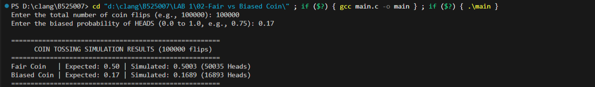

# Fair vs. Biased Coin Simulation in C

A C-based Monte Carlo simulation demonstrating probability theory by comparing a **fair coin toss** ($P(\text{Heads}) = 0.5$) against a **user-defined biased coin toss**.
---

## Demonstrations: Terminal



## Features

- **Empirical Probability Comparison**: Simulates thousands of independent coin tosses to verify theoretical probabilities.
- **Law of Large Numbers**: Demonstrates how empirical results converge toward theoretical expectation as trial counts increase.
- **Configurable Bias**: Allows dynamic user input for total flips and custom head probabilities.

## Getting Started

### Prerequisites
- GCC Compiler (or any C99-compliant compiler)
- `make` utility (optional)

### Building the Project


Manually with GCC:
```bash
gcc -Wall -Wextra -std=c99 -o coin_flip coin_flip.c
```

### Running the Program

```bash
./coin_flip
```

### Example Usage

```text
Enter the total number of coin flips (e.g., 100000): 1000000
Enter the biased probability of HEADS (0.0 to 1.0, e.g., 0.75): 0.75

======================================================
      COIN TOSSING SIMULATION RESULTS (1000000 flips)      
======================================================
Fair Coin   | Expected: 0.50 | Simulated: 0.5002 (500213 Heads)
Biased Coin | Expected: 0.75 | Simulated: 0.7498 (749821 Heads)
======================================================
```
