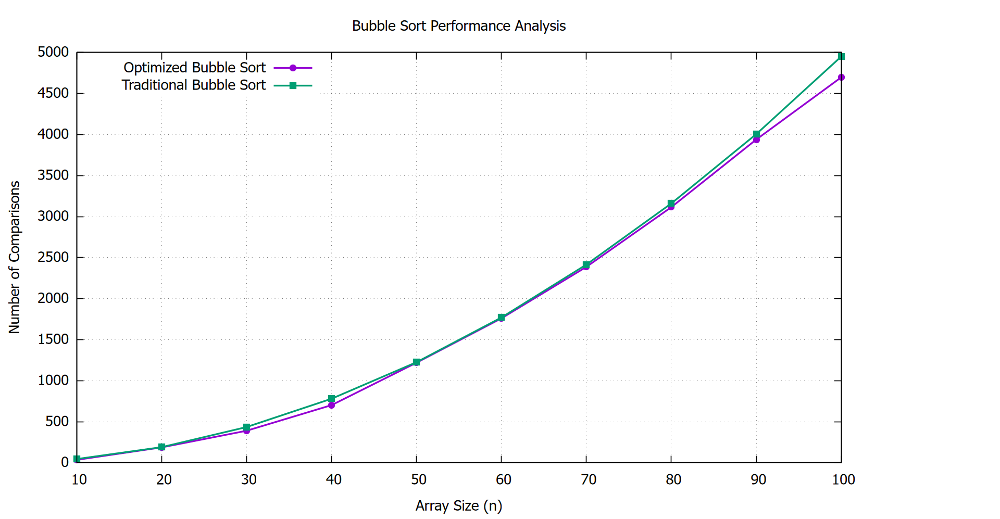

# Bubble Sort Performance Analysis

A C program that compares the performance of two Bubble Sort implementations by counting the number of comparisons made while sorting randomized arrays.

---

## Demonstration

### Terminal


### Grpah


---

## Objective

Implement and compare the following Bubble Sort algorithms:

1. **Optimized Bubble Sort**
   - Terminates early if the array becomes sorted before completing all `(n - 1)` passes.

2. **Traditional Bubble Sort**
   - Always completes all `(n - 1)` passes regardless of whether the array is already sorted.

The comparison is based on the **number of comparisons** performed by each algorithm.

---

## Project Structure

```
.
├── main.c
├── bubble.c
├── bubble.h
├── scripts/
│   └── bubble.gnu
└── output/
    └── comparison.dat
```

---

## Working

1. Generate a random array of size `n`.
2. Create two identical copies of the array.
3. Sort one copy using **Optimized Bubble Sort**.
4. Sort the other using **Traditional Bubble Sort**.
5. Count the number of comparisons made by each algorithm.
6. Store the results in `output/comparison.dat`.
7. Use **GNUPlot** to generate a comparison graph.

---

## Algorithms Compared

| Algorithm | Early Termination | Best Case | Worst Case |
|-----------|-------------------|-----------|------------|
| Optimized Bubble Sort | Yes | O(n) | O(n²) |
| Traditional Bubble Sort | No | O(n²) | O(n²) |

---

## Requirements

- GCC Compiler
- GNUPlot

---

## Installing GNUPlot

### Windows

1. Download GNUPlot from:
   https://sourceforge.net/projects/gnuplot/

2. Install the application.

3. Add the GNUPlot `bin` directory to the system **PATH**.

4. Verify installation:

```bash
gnuplot --version
```

---

## Compilation

```bash
gcc main.c bubble.c -o program
```

---

## Execution

Windows:

```bash
program
```

or

```bash
.\program.exe
```

---

## Output

Generated data file:

```
output/comparison.dat
```

Example:

```
#Size Optimized Traditional
10 45 45
20 190 190
30 428 435
40 735 780
```

The graph is displayed automatically using GNUPlot.

---

## Conclusion

- The **Traditional Bubble Sort** always performs the same number of comparisons because it completes all `(n - 1)` passes.

- The **Optimized Bubble Sort** can reduce the number of comparisons by terminating early when the array becomes sorted before all passes are completed.

- For completely random arrays, both algorithms often perform a similar number of comparisons. However, for nearly sorted arrays, the optimized version is significantly more efficient.

---
<br>

> Thank You