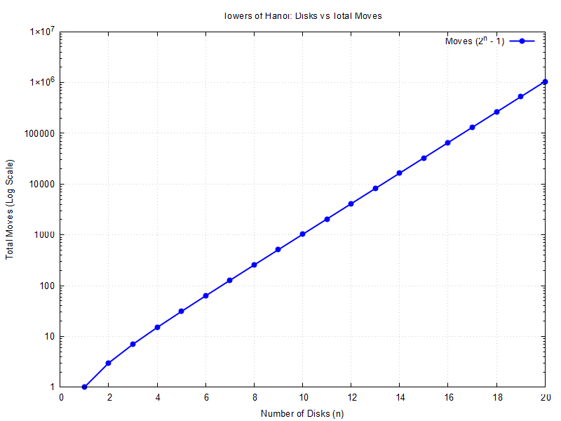

# Towers of Hanoi: Time Complexity Analysis & Plotter

A C implementation that simulates the recursive solution to the **Towers of Hanoi (ToH)** problem, counts the number of moves required for $n$ disks, and displays the results live using Gnuplot.

## Simulation Plot



---

## Algorithm Analysis & Conclusion

### 1. Recurrence Relation
The classic recursive solution yields the step recurrence:
$$T(n) = 2T(n-1) + 1, \quad T(1) = 1$$

Solving this yields the closed-form equation:
$$T(n) = 2^n - 1$$

### 2. Time Complexity
- **Time Complexity**: $\mathcal{O}(2^n)$ — Exponential growth.
- **Space Complexity**: $\mathcal{O}(n)$ — Call stack depth.

### 3. Key Observations from the Plot
- **Exponential Scaling**: Each additional disk ($n \to n+1$) doubles the total move count.
- **Semi-Log Linearity**: On a logarithmic scale $y$-axis, the line is perfectly linear, proving $O(2^n)$ growth visually.

---

## Build and Execution Instructions

### Prerequisites
- GCC Compiler (`gcc`)
- Gnuplot (`gnuplot`) with GUI terminal support

### 1. Build
```bash
gcc main.c -o toh_sim -lm
```

### 2. Run

**Windows (PowerShell / CMD):**

```bash
.\toh_sim.exe
```


### 3. Clean (Optional)

**Windows (PowerShell / CMD):**

```bash
del toh_sim.exe
```

---
<br>

> Thank You