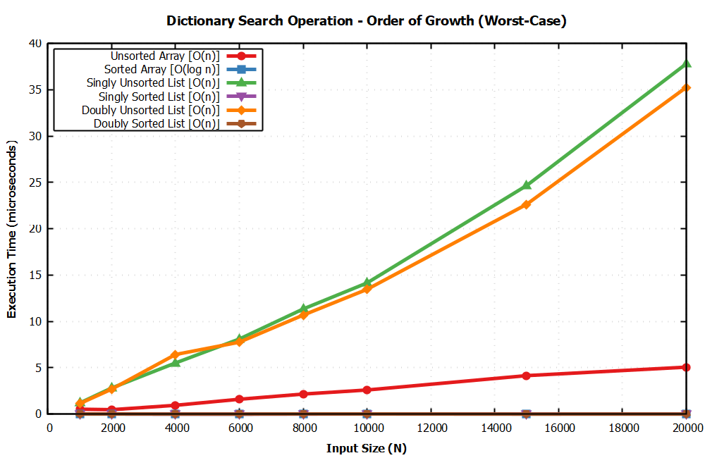
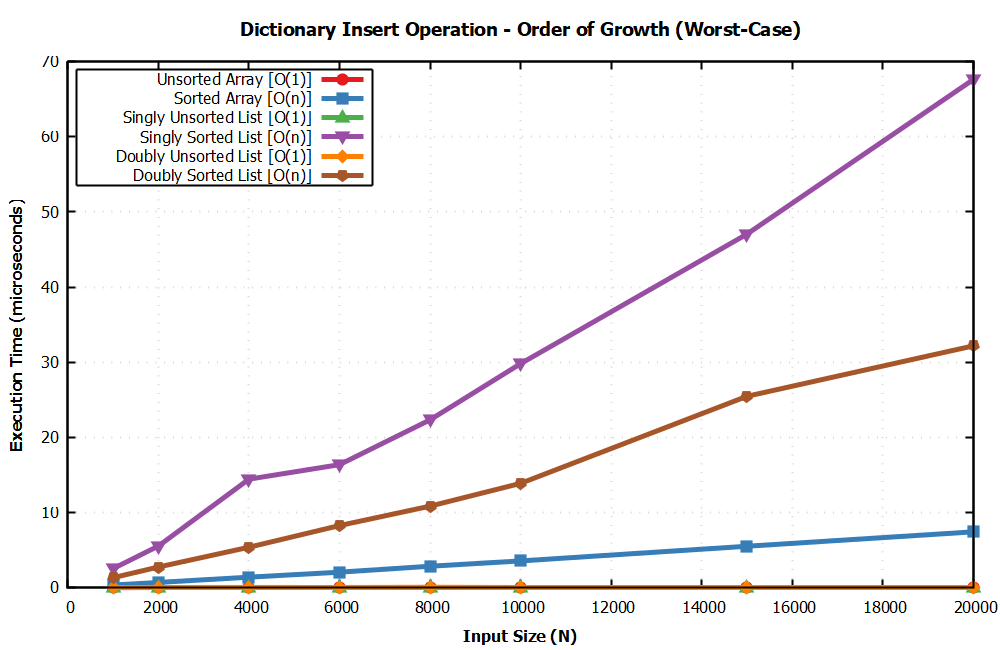
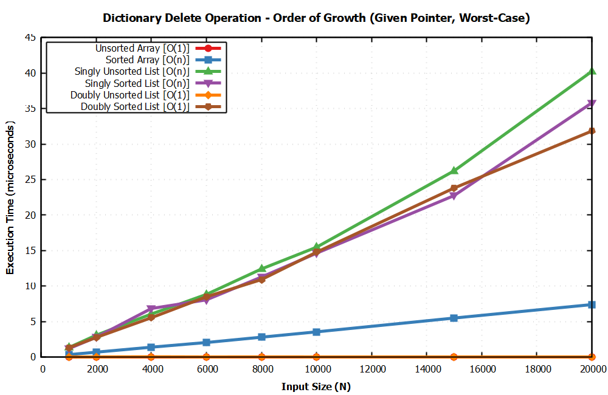
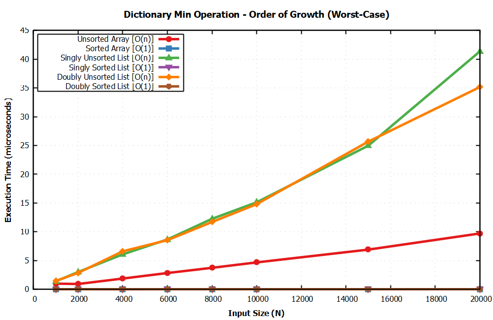
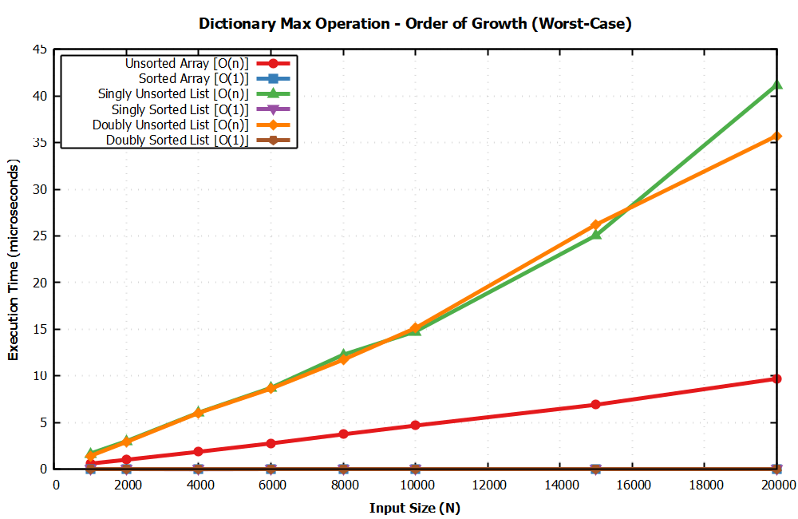
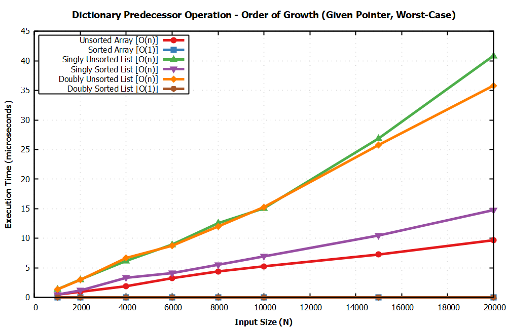
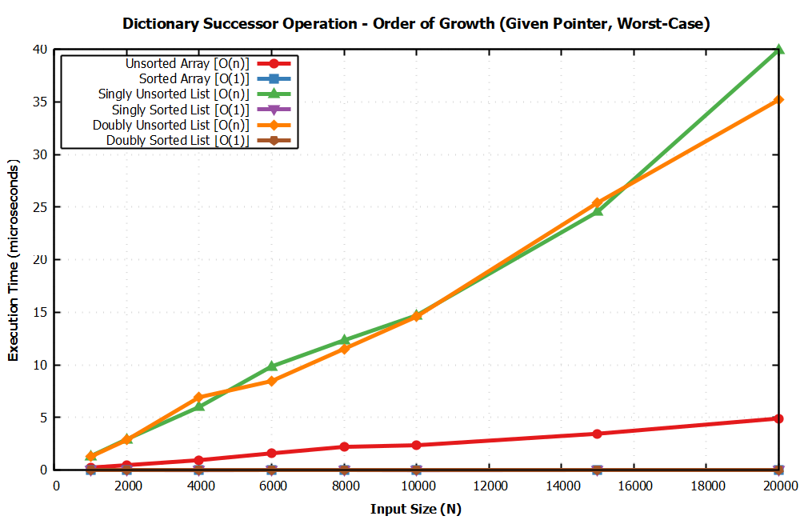

# Dictionary Operations Complexity Analysis & Benchmark

This repository contains a C implementation and empirical performance analysis validating the asymptotic worst-case running times of **7 primary Dictionary Abstract Data Type (ADT) operations** across **6 different data structures**.

The empirical results are measured in C and plotted using **GNUplot**, producing **7 distinct PNG graphs** (one for each operation), where each graph compares all 6 data structures.

---

## Table of Contents
- [Problem Description](#problem-description)
- [Primary Operations](#primary-operations)
- [Asymptotic Worst-Case Running Times](#asymptotic-worst-case-running-times)
- [Empirical Performance Plots](#empirical-performance-plots)
  - [1. Search Operation](#1-search-operation)
  - [2. Insert Operation](#2-insert-operation)
  - [3. Delete Operation](#3-delete-operation)
  - [4. Minimum Operation](#4-minimum-operation)
  - [5. Maximum Operation](#5-maximum-operation)
  - [6. Predecessor Operation](#6-predecessor-operation)
  - [7. Successor Operation](#7-successor-operation)
- [Project Architecture](#project-architecture)
- [Build and Run Instructions](#build-and-run-instructions)

---

## Problem Description
Consider a dictionary $D$ ADT that permits access to data items by content (key). The project evaluates the running times when $D$ is implemented using:
1. **Unsorted Array**
2. **Sorted Array**
3. **Singly Linked Unsorted List**
4. **Singly Linked Sorted List**
5. **Doubly Linked Unsorted List**
6. **Doubly Linked Sorted List**

---

## Primary Operations
- $\text{Search}(D, k)$: Given search key $k$, return pointer to element with key $k$.
- $\text{Insert}(D, x)$: Given data item $x$, add it to dictionary $D$.
- $\text{Delete}(D, x)$: Given pointer $x$ to a data item in $D$, remove it from $D$.
- $\text{Min}(D)$ / $\text{Max}(D)$: Retrieve item with smallest / largest key from $D$.
- $\text{Predecessor}(D, x)$ / $\text{Successor}(D, x)$: Retrieve item from $D$ whose key is immediately before / after item $x$ in sorted order.

---

## Asymptotic Worst-Case Running Times

| Data Structure | Search | Insert | Delete (given ptr) | Minimum | Maximum | Predecessor (given ptr) | Successor (given ptr) |
| :--- | :---: | :---: | :---: | :---: | :---: | :---: | :---: |
| **Unsorted Array** | $O(n)$ | $O(1)$ | $O(1)$* | $O(n)$ | $O(n)$ | $O(n)$ | $O(n)$ |
| **Sorted Array** | $O(\log n)$ | $O(n)$ | $O(n)$ | $O(1)$ | $O(1)$ | $O(1)$ | $O(1)$ |
| **Singly Linked Unsorted** | $O(n)$ | $O(1)$ | $O(n)$ | $O(n)$ | $O(n)$ | $O(n)$ | $O(n)$ |
| **Singly Linked Sorted** | $O(n)$ | $O(n)$ | $O(n)$ | $O(1)$ | $O(1)$** | $O(n)$ | $O(1)$ |
| **Doubly Linked Unsorted** | $O(n)$ | $O(1)$ | $O(1)$ | $O(n)$ | $O(n)$ | $O(n)$ | $O(n)$ |
| **Doubly Linked Sorted** | $O(n)$ | $O(n)$ | $O(1)$ | $O(1)$ | $O(1)$** | $O(1)$ | $O(1)$ |

*\* Delete in an unsorted array takes $O(1)$ time by overwriting target element with the last element. If order must be preserved by shifting, it takes $O(n)$.*  
*\*\* Assuming a tail pointer is maintained in sorted linked lists.*

---

## Empirical Performance Plots

Each of the following 7 PNG graphs plots the execution time (in microseconds) against input size $N \in [1000, 20000]$ for all 6 data structures.

### 1. Search Operation

- **Sorted Array** achieves logarithmic order of growth $O(\log n)$ via Binary Search.
- **Linked Lists & Unsorted Array** exhibit linear scaling $O(n)$ due to sequential search requirement.

---

### 2. Insert Operation

- **Unsorted structures** (Unsorted Array, Singly Unsorted, Doubly Unsorted) insert in $O(1)$ constant time at head/tail.
- **Sorted structures** require $O(n)$ time to locate insertion point (lists) or shift elements (array).

---

### 3. Delete Operation

- Given a node pointer, **Doubly Linked Lists** and **Unsorted Arrays** delete in $O(1)$ time.
- **Sorted Array** takes $O(n)$ time to shift remaining elements left.
- **Singly Linked Lists** take $O(n)$ time to locate the predecessor node.

---

### 4. Minimum Operation

- **Sorted structures** maintain minimum key at head/first index in $O(1)$ time.
- **Unsorted structures** require scanning all $n$ elements ($O(n)$ time).

---

### 5. Maximum Operation

- **Sorted Array & Tail-maintained Sorted Linked Lists** retrieve maximum element in $O(1)$ constant time.
- **Unsorted structures** require full $O(n)$ linear scan.

---

### 6. Predecessor Operation

- Given node/index pointer $x$, **Sorted Array** ($x-1$) and **Doubly Linked Sorted List** ($x \to \text{prev}$) find predecessor in $O(1)$ time.
- **Singly Linked Lists** and **Unsorted structures** require $O(n)$ traversal.

---

### 7. Successor Operation

- Given node/index pointer $x$, **Sorted Array**, **Singly Linked Sorted List**, and **Doubly Linked Sorted List** access successor in $O(1)$ time.
- **Unsorted structures** require searching the dataset for the minimum value greater than $x$ ($O(n)$ time).

---

## Project Architecture

```
Lab 2 Q-1/
├── .gitignore             # Ignores compiled binaries and temporary OS files
├── Makefile               # Build automation script
├── README.md              # Project documentation and performance report
├── benchmark.exe          # Compiled benchmark runner
├── src/
│   ├── dictionary.h       # Unified header with struct & function definitions
│   ├── unsorted_array.c   # Unsorted Array implementation
│   ├── sorted_array.c     # Sorted Array implementation
│   ├── singly_unsorted.c  # Singly Linked Unsorted List implementation
│   ├── singly_sorted.c    # Singly Linked Sorted List implementation
│   ├── doubly_unsorted.c  # Doubly Linked Unsorted List implementation
│   ├── doubly_sorted.c    # Doubly Linked Sorted List implementation
│   └── main.c             # Benchmark harness exporting CSV metrics
├── scripts/
│   └── plot_all.gp        # Master GNUplot script generating 7 PNG plots
├── data/                  # Benchmark CSV outputs for each operation
└── plots/                 # Rendered GNUplot PNG graphs
```

---

## Build and Run Instructions

### Prerequisites
- **GCC Compiler** (MinGW-w64 on Windows or native GCC on Linux/macOS)
- **GNUplot** (v5.0 or later)

### Step-by-Step Execution

1. **Compile the Benchmark Harness**:
   ```bash
   make
   ```
   *(Or manually via GCC: `gcc -O2 -Isrc src/*.c -o benchmark`)*

2. **Execute Benchmarks & Export CSV Data**:
   ```bash
   make run
   ```
   *(Generates CSV data files inside `data/` directory)*

3. **Generate GNUplot Graphs**:
   ```bash
   make plot
   ```
   *(Generates 7 high-resolution PNG plots inside `plots/` directory)*

4. **Clean Build Artifacts**:
   ```bash
   make clean
   ```
