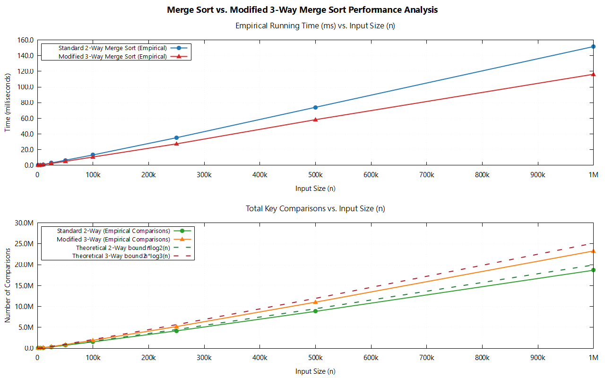

# 2-Way Merge Sort vs. Modified 3-Way Merge Sort

[](https://en.wikipedia.org/wiki/C11_(C_standard_revision))
[]()
[](http://www.gnuplot.info/)
[](https://opensource.org/licenses/MIT)

An empirical and theoretical comparative study of **Standard 2-Way Merge Sort** vs. **Modified 3-Way Merge Sort**, complete with automated benchmarking, asymptotic complexity analysis via the Master Theorem, and interactive **GNUPlot** visualization.

---

## 📌 Problem Statement

> **Consider the following modification to merge sort:** divide the input array into thirds (rather than halves), recursively sort each third, and finally combine the results using a three-way merge subroutine.
> 
> 1. What is the worst-case running time of this modified merge sort?
> 2. Write a C program to validate your claim by plotting the order of growth for both the standard merge sort and the modified merge sort.

---

## 💡 Theoretical Answer to the Sub-Question

### 1. Recurrence Relation
Let $T(n)$ denote the worst-case running time of the 3-way modified merge sort on an array of size $n$:
- **Divide step**: Finding the two split points $mid_1 = low + \lfloor(high - low)/3\rfloor$ and $mid_2 = low + \lfloor 2(high - low)/3\rfloor$ takes $\Theta(1)$ constant time.
- **Conquer step**: The algorithm makes $3$ recursive calls on subarrays of size $\approx n/3$, contributing $3 \, T(n/3)$.
- **Combine step**: The 3-way merge compares the smallest unconsumed elements among the 3 segments. In the worst case, finding the minimum of 3 values takes at most $2$ comparisons per merged element, yielding $\Theta(n)$ time.

The recurrence is:
$$T(n) = 3 \, T\left(\frac{n}{3}\right) + \Theta(n) \quad \text{for } n > 1$$
$$T(1) = \Theta(1)$$

---

### 2. Proof using the Master Theorem
The Master Theorem applies to recurrences of the form:
$$T(n) = a \, T\left(\frac{n}{b}\right) + f(n)$$
where:
- $a = 3$ (number of subproblems)
- $b = 3$ (subproblem reduction factor)
- $f(n) = \Theta(n) = \Theta(n^1)$

Calculate the critical exponent:
$$\log_b a = \log_3 3 = 1$$

Since $f(n) = \Theta\left(n^{\log_b a}\right) = \Theta(n^1)$, this satisfies **Case 2** of the Master Theorem:
$$T(n) = \Theta\left(n^{\log_b a} \log n\right) = \Theta(n \log_3 n) = \mathbf{\Theta(n \log n)}$$

**Conclusion:** The worst-case running time of the modified 3-way merge sort is $\mathbf{\Theta(n \log n)}$.

---

### 3. Constant Factor Comparison: 2-Way vs. 3-Way

| Metric | Standard 2-Way Merge Sort | Modified 3-Way Merge Sort |
| :--- | :--- | :--- |
| **Recurrence** | $T(n) = 2T(n/2) + \Theta(n)$ | $T(n) = 3T(n/3) + \Theta(n)$ |
| **Recursion Tree Height** | $\log_2 n$ | $\log_3 n = \frac{\log_2 n}{\log_2 3} \approx 0.631 \log_2 n$ |
| **Worst-case Comparisons / Level** | $\le 1 \cdot n$ | $\le 2 \cdot n$ |
| **Total Key Comparisons** | $\approx 1.000 \, n \log_2 n$ | $\approx 2n \log_3 n = \frac{2}{\log_2 3} n \log_2 n \approx \mathbf{1.262 \, n \log_2 n}$ |
| **Asymptotic Time Complexity** | $\mathbf{\Theta(n \log n)}$ | $\mathbf{\Theta(n \log n)}$ |

> **Key Insight:** Even though 3-way merge sort reduces the height of the recursion tree by $\approx 37\%$ ($\log_3 n$ vs $\log_2 n$), it requires up to $2$ comparisons per element merged (compared to $1$ comparison for 2-way merge), leading to roughly **$26\%$ more comparisons** overall. Both algorithms possess identical asymptotic growth $\Theta(n \log n)$.

---

## 📊 Empirical Benchmarking Results

Benchmark run on Windows with GCC 14.2.0 (`-O2` optimization) averaged over 5 trials per array size:

| Array Size ($n$) | 2-Way Time (ms) | 2-Way Comparisons | 3-Way Time (ms) | 3-Way Comparisons | Ratio (3-Way / 2-Way Comp) |
| :---: | :---: | :---: | :---: | :---: | :---: |
| **1,000** | 0.044 | 8,713 | 0.041 | 10,755 | **1.234** |
| **5,000** | 0.247 | 55,208 | 0.225 | 68,339 | **1.238** |
| **10,000** | 0.521 | 120,424 | 0.479 | 149,295 | **1.240** |
| **25,000** | 1.410 | 334,152 | 1.317 | 415,457 | **1.243** |
| **50,000** | 3.000 | 718,263 | 2.708 | 893,924 | **1.245** |
| **100,000** | 6.364 | 1,536,344 | 5.748 | 1,910,477 | **1.244** |
| **250,000** | 16.591 | 4,168,513 | 15.315 | 5,199,497 | **1.247** |
| **500,000** | 35.360 | 8,837,300 | 31.403 | 11,039,656 | **1.249** |
| **1,000,000** | 71.844 | 18,674,198 | 65.838 | 23,286,917 | **1.247** |

*Notice how the empirical comparison ratio ($\approx 1.247$) closely matches the theoretical upper bound factor of $\frac{2}{\log_2 3} \approx 1.262$.*

---

## 📈 Generated Plots

When the program executes, it automatically generates `runtime_comparison.png` and opens an interactive GNUPlot window:



---

## 🚀 Getting Started & Compilation

### Prerequisites
- **GCC Compiler** (MinGW-w64 on Windows, or GCC on Linux/macOS)
- **GNUPlot** (Version 5.0+)

### Quick Build & Run

#### Using Makefile:
```bash
make
make run
```

#### Manual Compilation:
```bash
gcc -O2 -Wall -Wextra main.c -o merge_compare
./merge_compare
```

---

## 📁 Repository Structure

```
Lab 2 Q-2/
├── main.c                  # Complete C source code (Algorithms + Benchmarks + Terminal Report + GNUPlot trigger)
├── plot.gp                 # GNUPlot script for visualization
├── Makefile                # Build automation
├── .gitignore              # Git ignore configuration
├── runtime_comparison.png  # High-resolution generated plot
├── benchmark_results.dat   # Exported benchmark data points
└── README.md               # Project documentation and mathematical proofs
```

---

## 🧑‍💻 Author & Course Info
- **Course**: Design and Analysis of Algorithms (DAA) - Lab 2
- **Topic**: Divide and Conquer, Merge Sort Variants, Order of Growth
