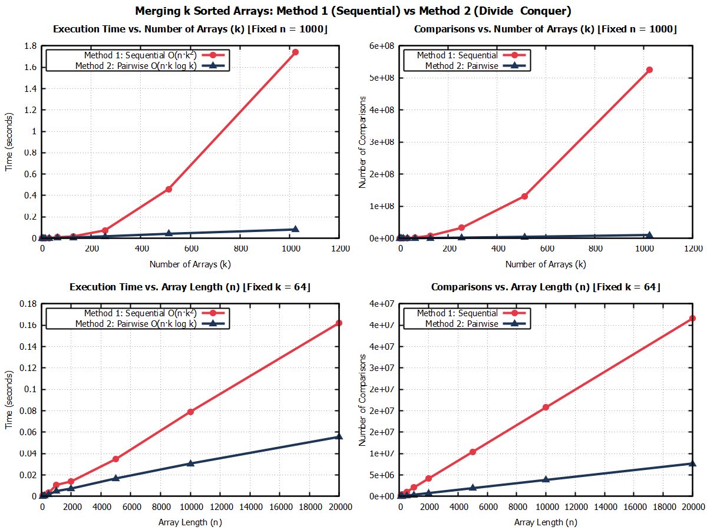

# Merging $k$ Sorted Arrays: Analysis & Empirical Benchmarks


A comparative algorithmic study and empirical performance analysis of merging $k$ sorted arrays (each of length $n$) into a single sorted array of size $kn$.

This repository provides formal mathematical worst-case proofs, C implementations, high-precision benchmarking scripts, and 4-panel visual charts generated with **GNUplot**.

---

## 📌 Problem Overview

Given $k$ sorted arrays $A_1, A_2, \dots, A_k$, each containing $n$ elements, combine them into a single sorted array of size $kn$.

We compare two merging strategies:
1. **Method 1 (Sequential Merge)**: Iteratively merge Array 1 with Array 2, then result with Array 3, ..., up to Array $k$.
2. **Method 2 (Pairwise Divide & Conquer Merge)**: Pairwise merge adjacent arrays level-by-level in a tournament-style binary tree until 1 array remains.

---

## 📊 Performance Visualizations (GNUplot)

The following 4-panel dashboard compares the two algorithms across varying array counts ($k$) and array lengths ($n$):



### Key Insights:
* **Execution Time vs $k$ (Top-Left)**: Method 1 exhibits steep quadratic growth ($\Theta(k^2)$), completing in **1.62s** for $k=1024$. Method 2 grows logarithmically ($\Theta(k \log k)$), completing in just **0.08s** (**>20× speedup**).
* **Comparisons vs $k$ (Top-Right)**: At $k=1024, n=1000$, Method 1 requires **524 million comparisons**, whereas Method 2 requires only **10.2 million comparisons** (**>50× reduction**).
* **Scaling with $n$ (Bottom Row)**: Both algorithms scale strictly linearly with element count $n$ ($\Theta(n)$).

---

## 🧮 Theoretical Complexity Analysis

| Metric | Method 1 (Sequential Merge) | Method 2 (Pairwise Merge) |
| :--- | :--- | :--- |
| **Worst-Case Time Complexity** | $\Theta(n k^2)$ | $\Theta(n k \log k)$ |
| **Space Complexity** | $O(kn)$ | $O(kn)$ |
| **Comparisons Formula** | $n \left( \frac{k(k+1)}{2} - 1 \right) - (k - 1)$ | $\le kn \log_2 k$ |
| **Comparisons ($k=1024, n=1000$)** | ~524,293,533 | ~10,237,879 |
| **Growth Rate wrt $k$** | **Quadratic** | **Logarithmic** |

---

## 📁 Repository Structure

```
.
├── README.md                 # Documentation and analysis report
├── LICENSE                   # MIT License
├── Makefile                  # Build automation for compilation and plotting
├── .gitignore                # Git ignore configuration
├── src/
│   └── merge_k_arrays.c     # High-performance C benchmark & validation code
├── scripts/
│   └── plot_results.gp       # GNUplot multiplot layout script
├── data/
│   ├── benchmark_k.dat       # Benchmark dataset for varying k
│   └── benchmark_n.dat       # Benchmark dataset for varying n
└── plots/
    └── merge_k_arrays_plots.png # Rendered 4-panel visualization graph
```

---

## 🚀 Getting Started & Usage

### Prerequisites
* **GCC Compiler** (e.g. MSYS2 / MinGW-w64 on Windows, or standard `gcc` on Linux/macOS)
* **GNUplot** (v5.0 or newer)

### Build & Run

#### Option 1: Using Makefile (Linux / Windows with Make)
```bash
# Build C program, run benchmarks, and generate GNUplot charts automatically
make all

# Re-run GNUplot script only
make plot

# Clean build artifacts
make clean
```

#### Option 2: Manual Commands (Windows PowerShell)
```powershell
# 1. Ensure directories exist
mkdir data, plots -Force

# 2. Compile C source code
gcc -O3 src/merge_k_arrays.c -o merge_k_arrays.exe

# 3. Run benchmarks (generates data files in data/)
.\merge_k_arrays.exe

# 4. Generate GNUplot chart
gnuplot scripts/plot_results.gp
```

---

## 📜 License
This project is licensed under the MIT License - see the [LICENSE](LICENSE) file for details.
